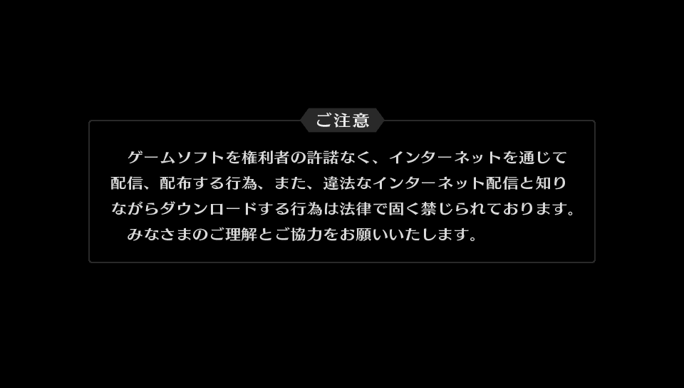
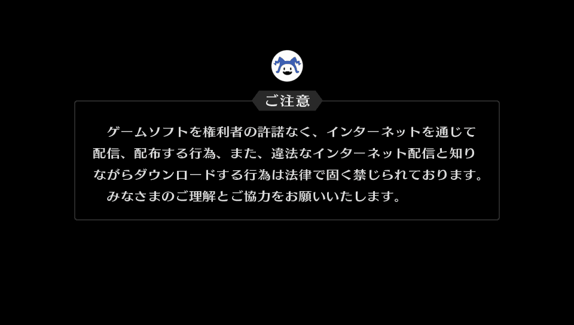
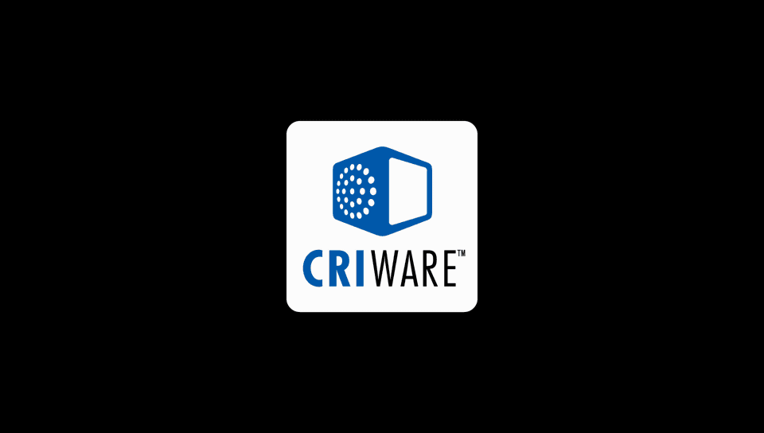
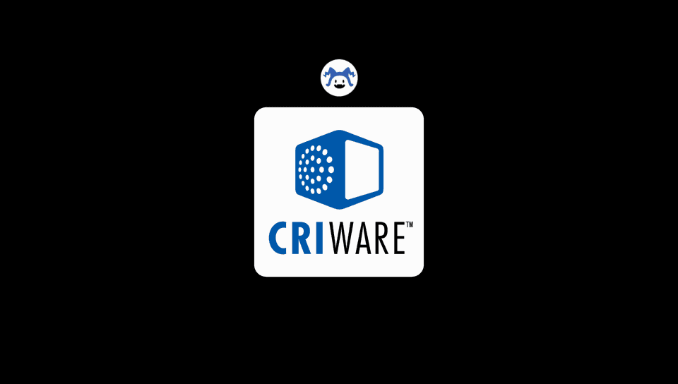
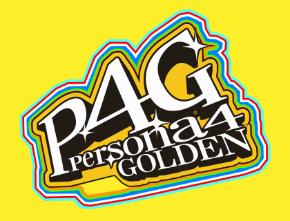
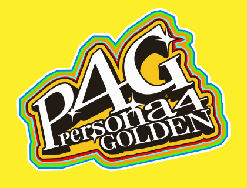

# Persona 4 Golden Patches (PS Vita)

Included patches:

- Intro Skip - Skips the boot logos and intro movie.
- Mod Support - Enables file replacement via a `mod.cpk` file.

Supported versions:

- `PCSE00120 01.00` (P4G US) - Intro Skip, Mod Support.
- `PCSB00245 01.00` (P4G EU) - Intro Skip, Mod Support.
- `PCSG00563 01.00` (P4G JP) - Intro Skip, Mod Support.

## Patching

1. Using your preferred method, dump a copy of P4G's eboot in ELF format.
   For example, using FAGDec, decrypt the eboot to SELF. You should end up with a decrypted `eboot.bin` file. Use `vita-unmake-fself` to extract `eboot.elf`.
2. Apply patches to `eboot.elf` using either:
   - [RPCS3PatchEboot](###-Using-RPCS3PatchEboot)
   - [heeboot](###-Using-heeboot)
   - [xdelta3](###-Using-xdelta3)
3. Using your preferred method, convert the patched eboot back to SELF format.
   For example, using `vita-elf-inject` you can inject the patched ELF into the original decrypted `eboot.bin` (make sure to keep a backup of the original decrypted SELF for future patching).
4. Finally, place the patched `eboot.bin` in `ux0:/rePatch/<title_id>/`.

### Using [RPCS3PatchEboot][1]

```txt
RPCS3PatchEboot eboot.elf ./patch/<title_id>.yml eboot.elf-out -FilterByName <patch1> <patch2> <...>
```

For example, to apply the `p4g_ModSupport` patch to `PCSE00120` (P4G US):

```txt
RPCS3PatchEboot eboot.elf ./patch/PCSE00120.yml eboot.elf-out -FilterByName p4g_ModSupport
```

### Using [heeboot][2]

```txt
heeboot eboot.elf ./patch/<title_id>.yml eboot.elf-out -n <patch1> <patch2> <...>
```

For example, to apply `p4g_IntroSkip` and `p4g_ModSupport` to `PCSE00120` (P4G US):

```txt
heeboot eboot.elf ./patch/PCSE00120.yml eboot.elf-out -n p4g_IntroSkip p4g_ModSupport
```

### Using [xdelta][3]

If necessary, merge the patches you want to apply:

```txt
xdelta3 merge -fvn -m <patch1> -m <patch2> -m <...> <patchN> _patch.xdelta
```

Then apply the merged patch:

```txt
xdelta3 -fvn -d -s eboot.elf _patch.xdelta eboot.elf-out
```

For example, to apply the `mod-support` patch to `PCSE00120` (P4G US):

```txt
xdelta3 -vfn -d -s eboot.elf ./patch/PCSE00120_mod-support.xdelta eboot.elf-out
```

## Building `mod.cpk`

Use the Amicitia Mod Compendium to pack mods into a `mod.cpk` file, then place it under P4G's `data` dir (`ux0:/rePatch/<title_id>/data/`).

An example mod is supplied with this patch.

## Testing

The provided example mod serves as a test to see if mod support is enabled.

After performing the required steps, launch the game and check the boot logos and title screen to see if they match the images under the "Mod" column below.

| Image  | Vanilla                | Mod                        |
|:------:|:----------------------:|:--------------------------:|
| 1 \*   |  |  |
| 2      |    |    |
| 3      |      |      |
| 4 \*\* |    |    |

\* This screen only appears on the JP version.

\*\* The `title.plg` logo frame fix is only apparent on the US/EU versions.

[1]: https://github.com/TGEnigma/RPCS3PatchEboot
[2]: https://github.com/zarroboogs/heeboot
[3]: https://github.com/jmacd/xdelta
